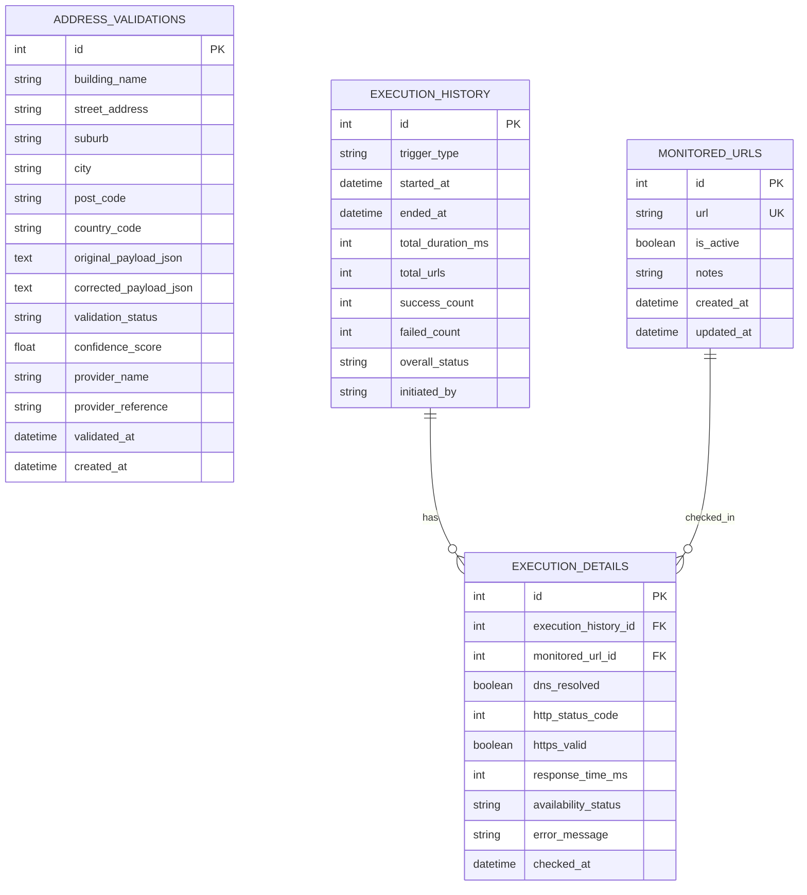

# Step 1 - Database Design

## Objective
Define normalized tables and relationships for address validation history and URL monitoring runs.

## Tables

### 1) address_validations
Stores each validation attempt.

Columns:
- id (PK)
- building_name
- street_address
- suburb
- city
- post_code
- country_code
- original_payload_json
- corrected_payload_json
- validation_status (VALID, PARTIAL, INVALID, ERROR)
- confidence_score (0.00 to 1.00)
- provider_name
- provider_reference
- validated_at (UTC timestamp)
- created_at (UTC timestamp)

Indexes:
- idx_address_validations_validated_at
- idx_address_validations_status

### 2) monitored_urls
Master list of URLs to test.

Columns:
- id (PK)
- url (unique)
- is_active (boolean)
- notes
- created_at (UTC timestamp)
- updated_at (UTC timestamp)

Indexes:
- uq_monitored_urls_url
- idx_monitored_urls_is_active

### 3) execution_history
One record per check run (manual or scheduled).

Columns:
- id (PK)
- trigger_type (MANUAL, SCHEDULED)
- started_at (UTC timestamp)
- ended_at (UTC timestamp)
- total_duration_ms
- total_urls
- success_count
- failed_count
- overall_status (SUCCESS, PARTIAL, FAILED)
- initiated_by

Indexes:
- idx_execution_history_started_at

### 4) execution_details
Per-URL result for a run.

Columns:
- id (PK)
- execution_history_id (FK -> execution_history.id)
- monitored_url_id (FK -> monitored_urls.id)
- dns_resolved (boolean)
- http_status_code
- https_valid (boolean)
- response_time_ms
- availability_status (UP, DOWN)
- error_message
- checked_at (UTC timestamp)

Indexes:
- idx_execution_details_history_id
- idx_execution_details_url_id
- idx_execution_details_availability

## Relationships
- execution_history (1) -> (N) execution_details
- monitored_urls (1) -> (N) execution_details

## ERD

